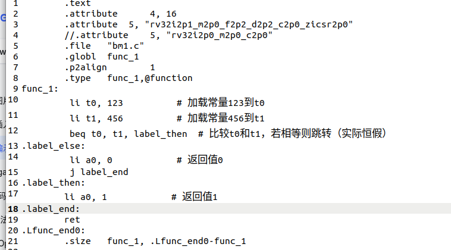
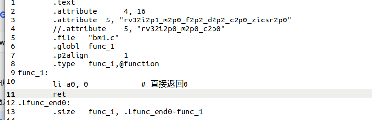

# RISC-V 汇编指令级优化器 (基于 LLVM)

llvm中的编译优化已经能将高级语言高效转化为二进制代码，然而若面对的是一个未经优化的汇编代码则无法进入llvm中编译优化的流程，生成高效的二进制代码。本项目是一个专门针对 **RISC-V (RV32I)** 基础指令集的后端优化工具。它***接收未优化的汇编代码***，修改llvm的汇编器部分，在汇编层面执行多轮优化，旨在减少指令冗余、平衡流水线负载并提升代码密度。

---

## 🛠 项目架构

本项目执行以下 Pipeline：

1.  **解析器 (Parser)**：将 `.s` 文件转化为指令链表与基本块 (Basic Blocks)。
2.  **CFG 构建**：建立控制流图，识别循环与分支跳转。
3.  **分析**：执行活跃变量分析等数据流分析。
4.  **转换**：执行 DCE、指令调度等实际修改操作。

---

## 🚀 核心优化特性

### 1. 常量传播 (Liveness Analysis)
基于数据流分析实现的前向分析。通过计算每个程序点的常量值格，精确推断变量在特定路径上是否为常量。
* **算法**：迭代定点算法 ，结合交运算合并不同路径的常量信息
* **用途**：计算每个寄存器当下当下是否为一个常量，进行判断表达式的计算。

### 2. 活跃变量分析 (Liveness Analysis)
基于 数据流分析实现的逆向分析。通过计算每个点的 `LiveIn` 和 `LiveOut` 集合，精确掌握寄存器的生命周期。
* **算法**：迭代定点算法 (Fixed-point Iteration)。
* **用途**：死代码消除的基石。

### 3. 死代码消除 (Dead Code Elimination, DCE)
自动识别并移除无效操作：
* 基于常量传播与活跃变量分析的结果，移除定义了寄存器但后续未被读取的指令，以及删除不会对程序造成影响的函数。
* 安全识别：确保被移除的指令不含 Side-effects（如内存写入）。
* *效果*：减少函数中未使用到的变量，未跳转到的基本块以及删除不会对程序造成影响的函数等等。

### 4. 指令调度 (Instruction Scheduling)
针对 RISC-V 典型的五级流水线进行重排。
* **启发式搜索**：采用 List Scheduling 算法。
* **目标**：拉开 Load 指令与其使用指令 (Load-to-Use) 之间的距离，减少流水线气泡 (Stalls)。
* **依赖保护**：严格遵守 RAW, WAW, WAR 数据依赖。

## 例子
* **输入未优化的汇编代码**

* **优化后**

